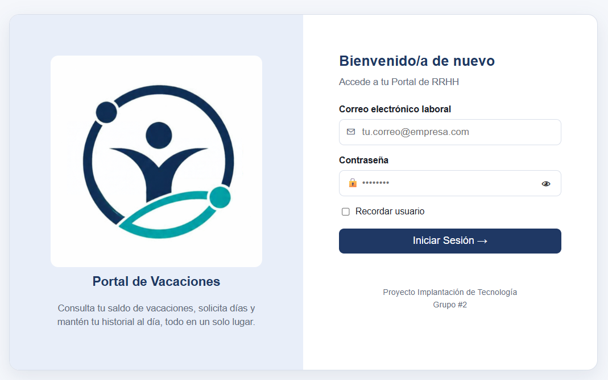
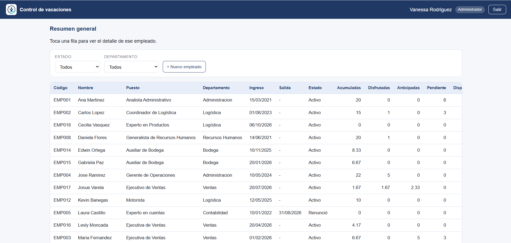
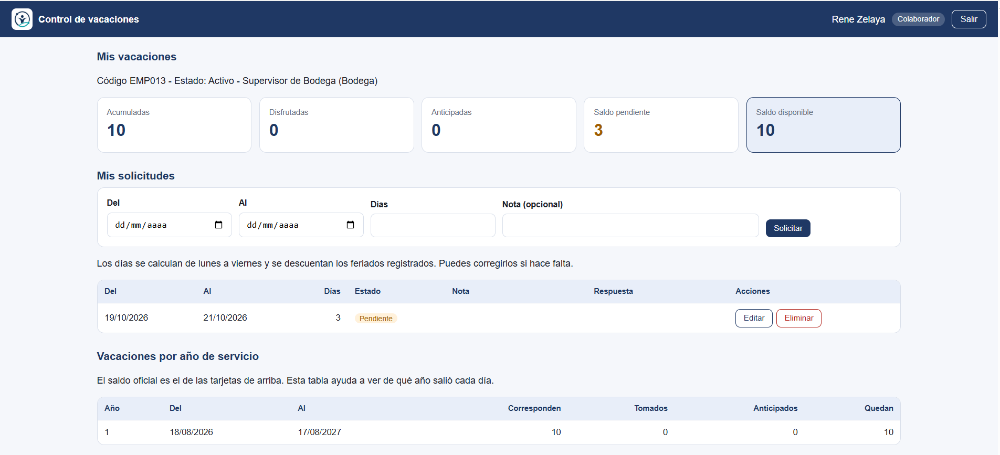
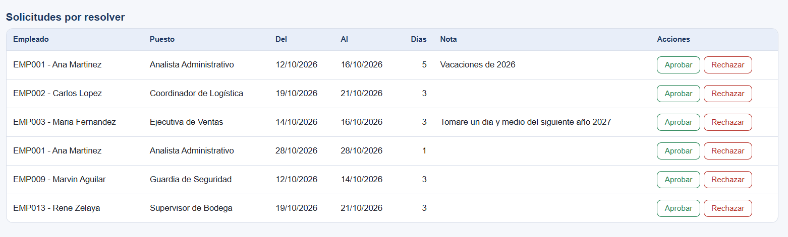

# Control de vacaciones

> Proyecto de la clase **Implantación de Tecnología**.

Proyecto académico para consultar saldos de vacaciones del personal.
Usa HTML, CSS y JavaScript, con Supabase (PostgreSQL) como base de datos.

## Capturas

### Inicio de sesión

### Resumen general (RRHH)

### Resumen general vista empleado

### Solicitudes de vacaciones

## Estructura

- `index.html`: la página
- `css/styles.css`: los estilos
- `js/config.js`: la conexión con Supabase (URL y llave publishable)
- `js/app.js`: la lógica de la página
- `img/`: imágenes del proyecto

## Cómo abrirlo

1. Descarga el repositorio.
2. Abre `index.html` en Chrome o Edge. Hace falta internet.
3. Inicia sesión con un usuario de prueba.

## Importante

- Los datos son ficticios.
- En `js/config.js` solo va la llave **publishable**. Nunca la llave secret ni service_role.
- Los saldos NO se calculan en la página. Los calcula la base de datos en la vista `saldos_vacaciones`.
- La seguridad está en la base de datos con Row Level Security. Cada colaborador solo ve sus datos.
